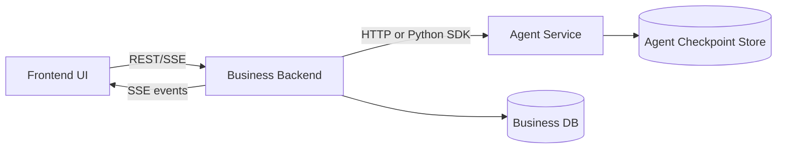
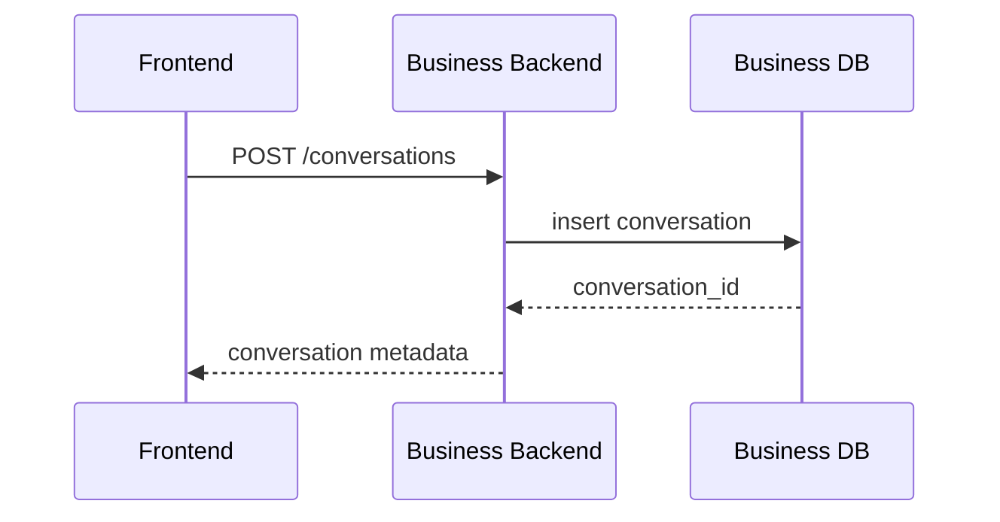
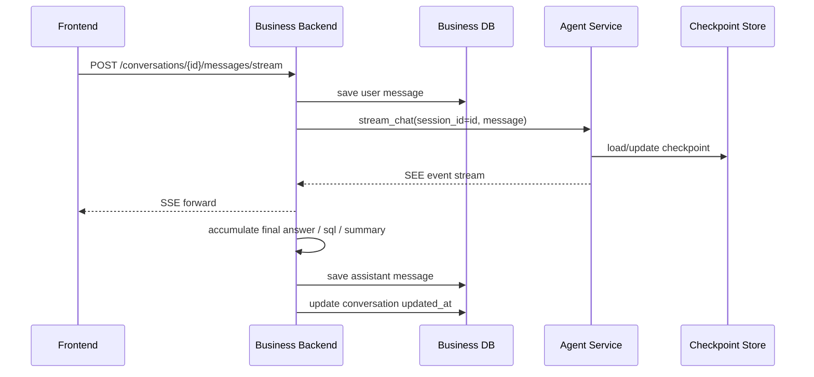
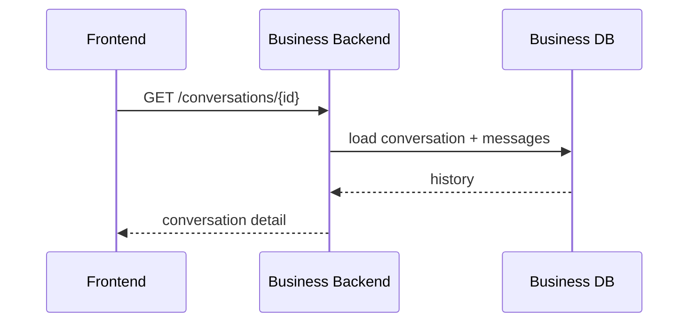
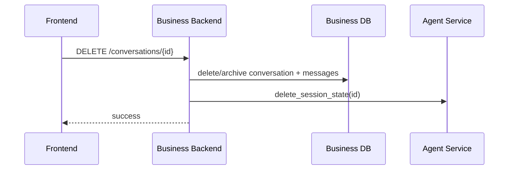

# SQLAgent Unified Interaction Spec

本文档统一说明当前系统中 **前端**、**业务后端**、**Agent 服务** 三层的职责边界、交互逻辑、数据归属和接口定义。

目标：

1. 明确三层职责，避免逻辑重复或职责漂移
2. 统一会话管理、流式输出、历史消息、Agent 状态的处理方式
3. 为前端、后端、Agent 开发提供同一份实现依据

---

## 1. 总体结论

### 1.1 分工原则

- **前端** 负责展示、交互、会话选择、流式渲染
- **业务后端** 负责会话管理、消息持久化、鉴权、流式转发
- **Agent 服务** 负责理解问题、执行 LangGraph、输出 SEE 事件流、维护 Agent 运行状态

### 1.2 历史保存原则

系统保存两类历史：

1. **业务消息历史**
   - 保存到业务后端数据库
   - 用于会话列表、历史消息展示、多端同步

2. **Agent 运行状态**
   - 保存到 Agent 的持久化 checkpoint
   - 用于继续同一会话、恢复图状态、延续记忆

### 1.3 流式输出原则

流式事件不直接从 Agent 推给前端，而是：

```text
Agent -> 业务后端 -> 前端
```

后端职责：

- 接收 Agent 的流式 SEE 事件
- 一边转发给前端
- 一边选择性持久化

---

## 2. 架构图



---

## 3. 职责划分

## 3.1 前端职责

- 会话列表展示
- 创建新会话
- 选择并继续某个会话
- 发送用户消息
- 渲染流式 SEE 事件
- 展示历史消息
- 展示思考区、工具区、SQL 区、最终回答区

前端不负责：

- 会话状态持久化
- Agent memory 管理
- 事件过滤与持久化策略
- 直接调用 LangGraph 或 MCP

## 3.2 业务后端职责

- 会话 CRUD
- 消息持久化
- 生成/维护 `conversation_id`
- 将 `conversation_id` 映射为 `session_id`
- 调用 Agent 服务
- 接收 Agent 流式事件并转发给前端
- 从流式事件中提取最终消息、SQL、摘要并落库

业务后端不负责：

- 大模型推理
- LangGraph 节点逻辑
- Agent 记忆内部结构

## 3.3 Agent 服务职责

- 接收 `session_id + user_message`
- 执行图流程
- 输出结构化 SEE 事件流
- 基于 checkpoint 维护该 `session_id` 的上下文
- 返回最终结果

Agent 服务不负责：

- 会话列表
- 历史消息 CRUD
- 前端可见的产品态存储

---

## 4. ID 约定

推荐统一：

- `conversation_id == session_id`

这样有两个好处：

1. 不需要维护 conversation 与 agent session 两套映射
2. 继续会话时后端可以直接把 `conversation_id` 传给 Agent

---

## 5. 数据归属

## 5.1 业务后端数据库

当前系统**不区分用户**，因此数据库设计中不需要 `user_id`、租户字段或权限域字段。

建议至少维护三张表，另加一个 Agent 会话状态表。

### 1. `conversations`

用途：

- 存储会话基本信息
- 支撑会话列表和最近更新时间排序
- 保存会话标题和会话级状态

建议字段：

| 字段名 | 类型 | 必填 | 说明 |
| --- | --- | --- | --- |
| `id` | `varchar(64)` | 是 | 会话主键，建议直接作为 `session_id` 传给 Agent |
| `title` | `varchar(255)` | 是 | 会话标题，初始可为“新对话”，后续可自动摘要更新 |
| `status` | `varchar(32)` | 是 | 会话状态，如 `active` / `archived` / `deleted` |
| `archived` | `boolean` | 是 | 是否归档，前端可据此做筛选 |
| `message_count` | `integer` | 是 | 当前会话的消息数，便于列表快速展示 |
| `last_message_preview` | `varchar(500)` | 否 | 最后一条消息摘要，用于会话列表预览 |
| `agent_status` | `varchar(32)` | 否 | 最近一次 Agent 执行状态，如 `idle` / `running` / `failed` |
| `agent_error_message` | `text` | 否 | 最近一次 Agent 执行失败的摘要错误 |
| `created_at` | `timestamp` | 是 | 会话创建时间 |
| `updated_at` | `timestamp` | 是 | 会话结构性更新时间 |
| `last_message_at` | `timestamp` | 否 | 最近一条消息写入时间 |
| `metadata_json` | `json/jsonb` | 否 | 扩展字段，用于保存置顶、标签、来源等信息 |

索引建议：

- 主键：`id`
- 普通索引：`updated_at desc`
- 普通索引：`last_message_at desc`
- 组合索引：`status, archived, updated_at desc`

### 2. `messages`

用途：

- 存储前端可见的历史消息
- 支撑刷新恢复、历史会话打开、消息顺序展示

建议字段：

| 字段名 | 类型 | 必填 | 说明 |
| --- | --- | --- | --- |
| `id` | `varchar(64)` | 是 | 消息主键 |
| `conversation_id` | `varchar(64)` | 是 | 所属会话 ID，外键关联 `conversations.id` |
| `seq` | `integer` | 是 | 会话内严格递增序号，保证前端稳定排序 |
| `role` | `varchar(32)` | 是 | `user` / `assistant` / `system` / `tool` |
| `content` | `text` | 是 | 消息正文 |
| `content_type` | `varchar(32)` | 是 | `text` / `markdown` / `sql` / `json` |
| `message_status` | `varchar(32)` | 是 | `streaming` / `completed` / `failed` |
| `final_sql` | `text` | 否 | 本轮问答最终生成的 SQL，通常仅 assistant 消息有值 |
| `tool_summary` | `json/jsonb` | 否 | 工具调用摘要数组，不建议保存 token 级过程 |
| `used_tables` | `json/jsonb` | 否 | 本轮问答使用到的表名列表 |
| `error_message` | `text` | 否 | 若本轮失败，保存最终错误摘要 |
| `created_at` | `timestamp` | 是 | 消息创建时间 |
| `completed_at` | `timestamp` | 否 | 流式输出完成时间 |
| `metadata_json` | `json/jsonb` | 否 | 扩展字段，可保存模型名、方言、运行参数等 |

约束建议：

- 唯一约束：`(conversation_id, seq)`
- 外键：`conversation_id -> conversations.id`

索引建议：

- 普通索引：`conversation_id, seq`
- 普通索引：`conversation_id, created_at`

### 3. `message_events`（可选）

用途：

- 保存关键中间事件的摘要态
- 支撑回放、调试、质检

不建议默认保存：

- 全量 token 级 `delta`
- 所有瞬时 UI 事件

建议字段：

| 字段名 | 类型 | 必填 | 说明 |
| --- | --- | --- | --- |
| `id` | `varchar(64)` | 是 | 事件主键 |
| `conversation_id` | `varchar(64)` | 是 | 所属会话 ID |
| `message_id` | `varchar(64)` | 否 | 对应 assistant 消息 ID，可为空 |
| `seq` | `integer` | 是 | 单轮内部递增事件序号 |
| `event_type` | `varchar(64)` | 是 | 如 `tool.result` / `sql.generated` / `sql.execution.completed` |
| `node` | `varchar(64)` | 否 | 产生该事件的节点名 |
| `stage` | `varchar(64)` | 否 | 当前逻辑阶段名 |
| `payload_json` | `json/jsonb` | 是 | 结构化事件内容 |
| `created_at` | `timestamp` | 是 | 事件写入时间 |

索引建议：

- 普通索引：`conversation_id, created_at`
- 普通索引：`message_id, seq`

### 4. `agent_sessions`（推荐）

用途：

- 保存业务后端视角的 Agent 会话摘要状态
- 不替代真正的 checkpoint store
- 便于后端判断某个 session 是否已初始化、最近是否失败

建议字段：

| 字段名 | 类型 | 必填 | 说明 |
| --- | --- | --- | --- |
| `session_id` | `varchar(64)` | 是 | 建议与 `conversation_id` 相同 |
| `checkpoint_key` | `varchar(255)` | 否 | 对应 Agent checkpoint 的存储键 |
| `status` | `varchar(32)` | 是 | `idle` / `running` / `failed` |
| `last_run_id` | `varchar(64)` | 否 | 最近一次运行 ID |
| `last_error_message` | `text` | 否 | 最近一次失败信息 |
| `last_active_at` | `timestamp` | 否 | 最近活跃时间 |
| `created_at` | `timestamp` | 是 | 初始化时间 |
| `updated_at` | `timestamp` | 是 | 最近更新时间 |

索引建议：

- 主键：`session_id`
- 普通索引：`last_active_at desc`

## 5.2 Agent Checkpoint Store

保存：

- `llm_messages`
- `chat_mode`
- `intent`
- `retry_count`
- graph checkpoint
- thread state

用途：

- 同一会话继续问答
- 记忆恢复
- 图中断恢复

---

## 6. 交互时序

## 6.1 创建会话



说明：

- 创建会话只经过业务后端
- 此时 Agent 不一定要参与
- 当前系统无用户维度，因此无需带 `user_id`

## 6.2 发送消息并流式问答



## 6.3 打开历史会话



说明：

- 历史消息从业务数据库取
- 不直接从 Agent checkpoint 取

## 6.4 删除会话



---

## 7. 前端 <-> 业务后端接口

## 7.1 创建会话

`POST /api/conversations`

请求：

```json
{
  "title": "可选标题"
}
```

响应：

```json
{
  "id": "conv_001",
  "title": "新对话",
  "created_at": "2026-05-30T12:00:00Z",
  "updated_at": "2026-05-30T12:00:00Z"
}
```

## 7.2 获取会话列表

`GET /api/conversations`

响应：

```json
{
  "items": [
    {
      "id": "conv_001",
      "title": "历史消费最高的订单",
      "updated_at": "2026-05-30T12:10:00Z",
      "last_message_preview": "历史消费金额最大的订单是..."
    }
  ]
}
```

## 7.3 获取单个会话详情

`GET /api/conversations/{id}`

响应：

```json
{
  "conversation": {
    "id": "conv_001",
    "title": "历史消费最高的订单"
  },
  "messages": [
    {
      "id": "msg_001",
      "role": "user",
      "content": "历史消费最高的订单是谁",
      "created_at": "2026-05-30T12:00:00Z"
    },
    {
      "id": "msg_002",
      "role": "assistant",
      "content": "历史消费金额最大的订单是...",
      "created_at": "2026-05-30T12:00:02Z",
      "metadata": {
        "sql": "SELECT ...",
        "used_tables": ["orders"]
      }
    }
  ]
}
```

## 7.4 删除会话

`DELETE /api/conversations/{id}`

响应：

```json
{
  "ok": true
}
```

## 7.5 流式发送消息

`POST /api/conversations/{id}/messages/stream`

请求：

```json
{
  "message": "历史消费金额最大的订单是谁"
}
```

响应：

- `Content-Type: text/event-stream`

SSE 数据参考 [SEE_FRONTEND_API.md](/data/liuqi/SQLAgent/SEE_FRONTEND_API.md)

---

## 8. 业务后端 <-> Agent 服务接口

推荐两种接法：

1. Python 模块调用
2. HTTP/SSE 服务调用

如果是服务化，建议如下。

## 8.1 流式问答

`POST /agent/chat/stream`

请求：

```json
{
  "session_id": "conv_001",
  "message": "历史消费金额最大的订单是谁",
  "stream": true
}
```

响应：

- SSE / NDJSON 结构化事件流

## 8.2 非流式问答

`POST /agent/chat`

请求：

```json
{
  "session_id": "conv_001",
  "message": "历史消费金额最大的订单是谁",
  "stream": false
}
```

响应：

```json
{
  "chat_mode": "sql",
  "final_answer": "历史消费金额最大的订单是...",
  "generated_sql": "SELECT ...",
  "query_results": [],
  "error_message": null
}
```

## 8.3 获取会话状态

`GET /agent/sessions/{session_id}`

响应：

```json
{
  "exists": true,
  "session_id": "conv_001"
}
```

## 8.4 删除会话状态

`DELETE /agent/sessions/{session_id}`

响应：

```json
{
  "ok": true
}
```

---

## 9. SEE 事件处理原则

业务后端在转发 Agent 事件时建议遵循：

### 9.1 全量转发

以下事件建议实时转发前端：

- 思考流
- 工具流
- SQL 流
- 节点状态流
- 最终回答流

### 9.2 摘要持久化

以下内容建议持久化：

- 用户消息
- 最终 assistant 回复
- 最终 SQL
- 使用到的表
- 关键工具摘要
- 错误信息

### 9.3 不建议默认长期保存

- 全量 token/chunk
- 所有瞬时中间事件
- 所有 UI 过渡状态

---

## 10. 前端展示建议

前端一轮 assistant 消息建议拆成 5 个区块：

1. `status_timeline`
2. `thinking`
3. `tool_calls`
4. `sql`
5. `final_answer`

其中：

- `thinking` 默认折叠
- `sql` 使用代码块卡片
- `tool_calls` 使用时间线或日志样式
- `final_answer` 作为主消息主体

---

## 11. 推荐实现优先级

### 第一阶段

- 业务后端实现会话 CRUD
- 业务后端实现流式转发
- Agent 支持基于 `session_id` 的连续问答

### 第二阶段

- Agent checkpoint 持久化
- 业务消息持久化
- 前端历史会话恢复

### 第三阶段

- 工具事件摘要持久化
- 标题自动生成
- 错误恢复与重试

---

## 12. 一句话总结

系统按下面这条主链路工作：

```text
前端负责展示与交互
业务后端负责会话与消息管理，并转发流式事件
Agent 服务负责执行问答与维护运行状态
```

最重要的边界是：

- **业务历史归后端**
- **运行状态归 Agent**
- **流式事件先经过后端，再到前端**
